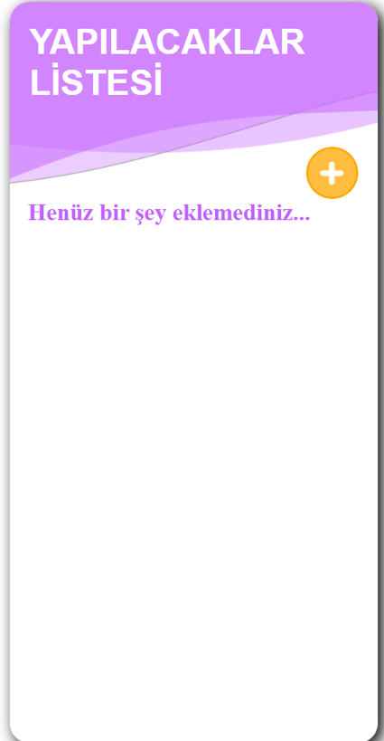

# Yapılacaklar Listesi  To Do App

JavaScript öğrenmeye devam ederken, bilgilerimi pekiştirmek adına pratikler yapmaya devam ediyorum. Burada da temel seviyede JavaScript ile basit bir To Do App yapmaya çalıştım.

***

**Uygulamaya Ait Bazı Görseller**

***

Yararlandığım kaynak : [Youtube -Yazılım Mektebi](https://www.youtube.com/watch?v=9GLe7tC2-g0)
